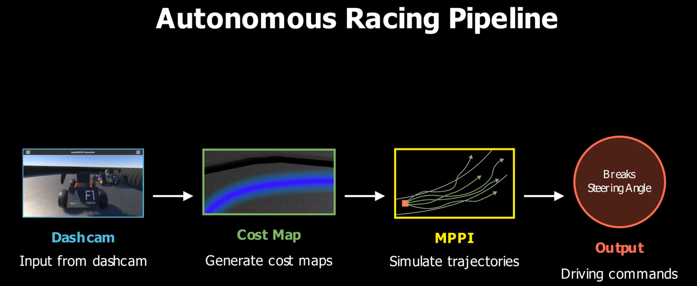
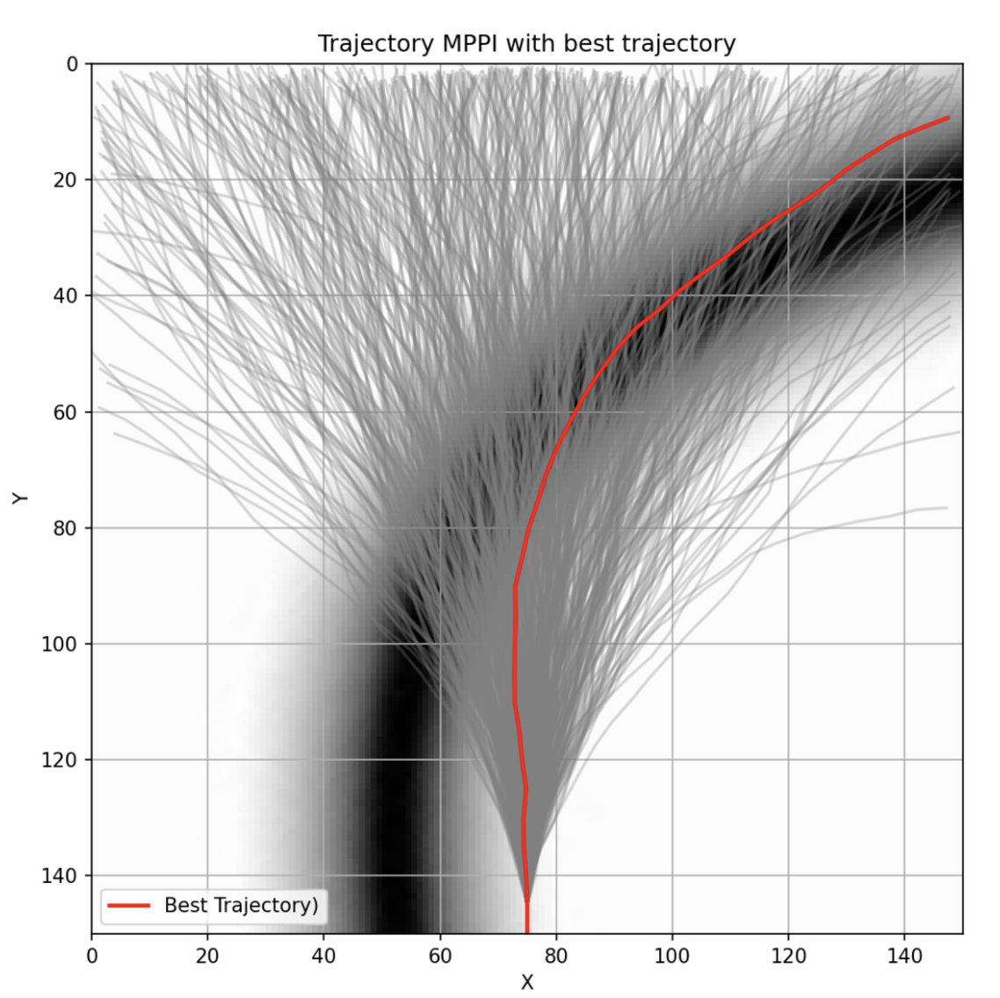
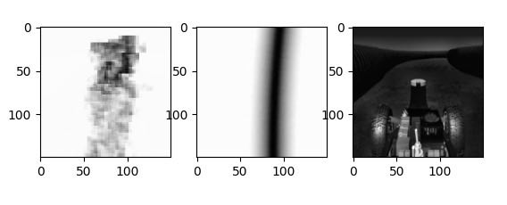

# F1TENTH DeepVision Costmaps

[](https://www.python.org/downloads/)
[](https://pytorch.org/)

Deep learning approach to autonomous racing using computer vision for F1TENTH platform. This project implements a U-Net-based neural network for real-time eagle view costmap prediction from dashcam front images, enabling high-speed navigation through vision-based perception on a already known circuit.

## Overview

This project presents a vision-based approach to autonomous racing that combines deep learning with Model Predictive Path Integral (MPPI) control. The system transforms monocular dashcam images into navigation costmaps using a U-Net architecture, providing a cost-effective alternative to expensive sensor setups like LiDAR.


*Complete processing pipeline: Dashcam input → U-Net costmap generation → MPPI trajectory optimization*

### Key Components

- **U-Net Model**: Convolutional neural network for dashcam-to-costmap translation
- **Context Network**: Alternative dilated convolution architecture
- **Dataset**: Generated using AutoDrive Simulator with data augmentation
- **Control**: MPPI integration for trajectory optimization from costmaps

## Method

### U-Net Architecture

The U-Net model predicts costmaps from 150×150 dashcam images in real-time:

- **Contracting Path**: Reduces spatial dimensions (16, 32 filters) with max-pooling
- **Bottleneck**: Feature extraction with 64-filter convolutional layers
- **Expanding Path**: Restores resolution via transpose convolutions and skip connections
- **Output**: Single convolution transforms features into costmaps

Training uses supervised learning with Mean Squared Error (MSE) loss.

### MPPI Control Strategy

Model Predictive Path Integral generates optimal trajectories from predicted costmaps:
- 200 candidate trajectories per costmap
- 50 points per trajectory with 30° steering limit
- Selects trajectory minimizing cost in low-cost regions


*MPPI algorithm generating candidate trajectories and selecting the optimal path (red line)*

## Models

### UNet150
- **Architecture**: Encoder-decoder with skip connections
- **Input/Output**: 150×150 grayscale images
- **Parameters**: ~270K (complexity_multiplier=4)
- **Specialization**: Spatial detail preservation

### Context Network
- **Architecture**: Dilated convolutions with identity initialization
- **Dilation factors**: [1,1,1,2,4,8,16,32,1]
- **Parameters**: ~47K
- **Specialization**: Multi-scale context understanding

## Installation

```bash
git clone https://github.com/your-username/f1tenth-deepvision-costmaps.git
cd f1tenth-deepvision-costmaps
pip install -r requirements.txt
```

## Usage

### Training Models

Train the U-Net model:
```bash
python scripts/train_unet.py
```

Train the Context Network:
```bash
python scripts/train_context.py
```

### Evaluation

Evaluate trained models:
```bash
python scripts/evaluate.py
```

### Interactive Demo

Explore results in Jupyter:
```bash
jupyter notebook notebooks/demo.ipynb
```

## Results

### Training Performance

The U-Net model shows effective learning with consistent training loss decrease. Validation curves indicate some overfitting, suggesting need for regularization or additional data.

### Costmap Generation

The model successfully generates costmaps from dashcam images, matching ground truth with room for improvement in edge definition:


*Left: Predicted costmap, Middle: Ground truth costmap, Right: Original dashcam input*

- **U-Net**: Excellent spatial preservation with skip connections
- **Context Network**: Efficient multi-scale context capture
- **Training Time**: ~15 minutes per epoch on GPU
- **Inference**: Real-time capable for racing applications

## Dataset

Data generated using [AutoDrive Simulator](https://autodrive-ecosystem.github.io/competitions/f1tenth-sim-racing-cdc-2024/) for F1TENTH racing simulation with:
- Monocular dashcam images (150×150)
- Corresponding bird's-eye view costmaps
- Data augmentation (brightness, cropping)
- Track maps for spatial reference

The AutoDrive platform provides realistic F1TENTH vehicle dynamics and racing environments, enabling comprehensive dataset generation for vision-based autonomous racing research.

### Data Structure

```
Data/
├── Dashcams/          # Input dashcam images (not included in repo)
├── Costmaps/          # Target costmap images (not included in repo)
└── TrackMap/          # F1TENTH circuit maps
```

**Note**: The input dashcam images and target costmap datasets are not included in this repository to avoid excessive file size. Only the circuit maps and trained models are provided. The dataset can be regenerated using the AutoDrive Simulator following the methodology described in the report.

## Technical Details

- **Framework**: PyTorch for neural networks, NumPy for MPPI
- **Loss Function**: L1Loss for sharp costmap boundaries
- **Optimizer**: Adam (lr=0.001)
- **Device**: Automatic CUDA/CPU detection
- **Image Size**: 150×150 optimized for real-time performance

## Future Work

- Reduce overfitting through regularization
- Optimize inference time for real-time deployment
- Integration with F1TENTH hardware platform
- Extended testing in complex racing environments

---

*Developed as part of POSTECH AIGS-538 Deep Learning course*